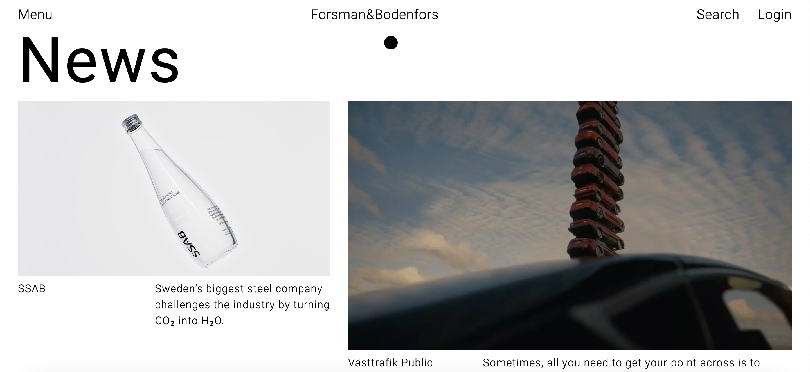

<h1 align="center"> Forsman & Bodenfors </h1>

<p align="center">This project is being created with <b>React</b>, <b>Redux</b> and <b>Typescript</b><br/>


<p align="center">
  <a href="#-technologies">Technologies</a>&nbsp;&nbsp;&nbsp;|&nbsp;&nbsp;&nbsp;
  <a href="#-project">Project</a>&nbsp;&nbsp;&nbsp;|&nbsp;&nbsp;&nbsp;
  <a href="#-execution">Execution</a>&nbsp;&nbsp;&nbsp;|&nbsp;&nbsp;&nbsp;
  <a href="#-Social Login">Social Login</a>&nbsp;&nbsp;&nbsp;|&nbsp;&nbsp;&nbsp;
  <a href="#-demo">Demo</a>&nbsp;&nbsp;&nbsp;&nbsp;&nbsp;&nbsp;

</p>

<br>

<p align="center">
  
</p>

## 🚀 Technologies

This project was developed using the following technologies and standards:

- React
- Typescript
- Redux
- Styled Components

## 💻 Project

This is a project recreating the official landing page of [Forsman & Bodenfors](https://www.forsman.com/) in React

## ⚙️ Execution

Install dependencies and run via Expo Go
```sh
yarn && yarn dev
```

## 👩‍💻 Social Login
You will need a "Facebook App ID" and a "Google Client ID"

    Rename the ".env.example" file to ".env".
    And put the keys in their respective places


Install dependencies and run via Expo Go
```sh
yarn && yarn dev
```

## 🖥 Demo

You  can see a preview [HERE](https://drive.google.com/file/d/1UnrewuY2QXkFVwzm_lNmRsWg1GW6kWj9/view?usp=sharing)

---


